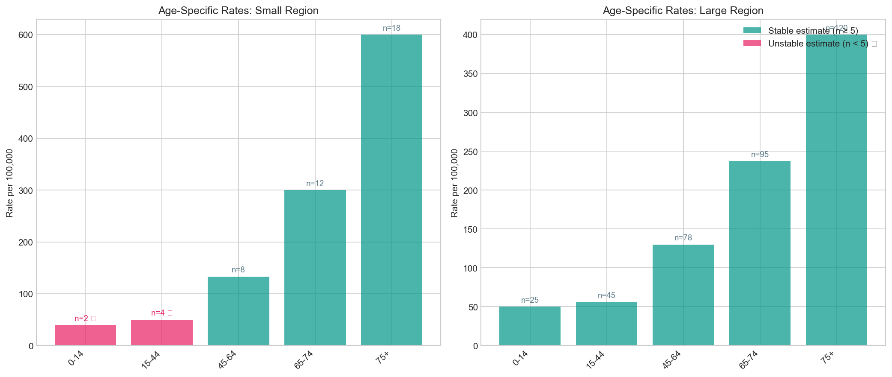

# Age-Specific Rate Table + Small-n Warnings

## 1. What it's for

**Age-specific rates** show how disease burden varies across age groups. They provide detailed understanding that summary measures (crude or age-standardized rates) obscure.

**Small-n warnings** flag estimates based on few cases, alerting users that these rates are statistically unstable and may change dramatically with one or two additional cases.

## 2. When appropriate

✅ **Use when:**

- Understanding which age groups are most affected
- Planning age-targeted interventions
- Investigating whether age patterns differ between populations
- Detailed reporting is required by stakeholders

❌ **Don't use when:**

- You only need a single summary number
- Data is too sparse for age stratification
- Age groupings are inconsistent between data sources

## 3. Data needed

| Field | Type | Units | Notes |
|-------|------|-------|-------|
| `age_group` | String | - | Age category labels (e.g., "0-14", "15-44") |
| `cases` | Integer | Count | Cases in each age group |
| `population` | Integer | Count | Population in each age group |

## 4. Definition / Formula

**Age-specific rate:**

$$
\text{Rate}_i = \frac{c_i}{n_i} \times \text{Scale}
$$

Where $i$ indexes age groups.

**Small-n flag:**

$$
\text{Flag}_i = \begin{cases} \text{True} & \text{if } c_i < \text{threshold} \\ \text{False} & \text{otherwise} \end{cases}
$$

Default threshold: **5 cases**

!!! note "Thresholds in practice"

    | Threshold | Interpretation |
    |-----------|----------------|
    | n < 5 | Very unstable; often suppressed in publications |
    | n < 10 | Unstable; interpret with strong caution |
    | n < 20 | Moderately unstable; note wide CIs |

    This recipe uses a **warning flag**, not automatic suppression. Suppression policies vary by jurisdiction and may consider privacy as well as statistical reliability.

## 5. Implementation notes

!!! warning "Edge cases"
    - **Zero cases:** Rate = 0, flagged as small-n
    - **Zero population:** Cannot calculate rate (excluded with warning)
    - **Aggregation:** If rates are unstable, consider combining adjacent age groups

!!! tip "Presentation best practices"
    1. Always show the case count alongside the rate
    2. Visually distinguish flagged estimates (color, symbol, footnote)
    3. Consider showing confidence intervals for all estimates
    4. Order age groups logically (youngest to oldest)

!!! warning "This is NOT formal suppression"
    Small-n flagging is about **statistical reliability**. Formal data suppression policies also consider **privacy/confidentiality** (e.g., counts 1-4 suppressed to prevent re-identification). This recipe addresses reliability only; follow your jurisdiction's suppression rules separately.

## 6. Worked example

Using data from `docs/assets/data/small_numbers_example.csv`:

**Small Region (unstable estimates):**

| Age Group | Cases | Population | Rate per 100k | Flag |
|-----------|-------|------------|---------------|------|
| 0-14 | 2 | 5,000 | 40.0 | ⚠ Unstable |
| 15-44 | 4 | 8,000 | 50.0 | ⚠ Unstable |
| 45-64 | 8 | 6,000 | 133.3 | |
| 65-74 | 12 | 4,000 | 300.0 | |
| 75+ | 18 | 3,000 | 600.0 | |

**Large Region (stable estimates):**

| Age Group | Cases | Population | Rate per 100k | Flag |
|-----------|-------|------------|---------------|------|
| 0-14 | 25 | 50,000 | 50.0 | |
| 15-44 | 45 | 80,000 | 56.3 | |
| 45-64 | 78 | 60,000 | 130.0 | |
| 65-74 | 95 | 40,000 | 237.5 | |
| 75+ | 120 | 30,000 | 400.0 | |



**Interpretation:**

- Both regions show increasing rates with age (expected pattern)
- Small Region's 0-14 and 15-44 estimates are flagged as unstable
- The rate of 40/100k (n=2) could easily double or halve with a few cases
- Large Region's estimates are all stable for interpretation

## 7. Common mistakes

!!! danger "Mistake: Treating flagged estimates as precise"
    A rate based on 3 cases has a very wide confidence interval. Don't draw conclusions like "Region X has higher rates in young people" if based on n=3 vs n=4.

!!! danger "Mistake: Suppressing without explanation"
    If you suppress or flag values, explain why. Users may assume missing data is zero or an error.

!!! danger "Mistake: Inconsistent age groups"
    Don't compare "15-44" in one dataset to "15-24, 25-34, 35-44" in another without aggregating properly. Age group definitions must match.

!!! danger "Mistake: Cherry-picking stable estimates"
    Reporting only the stable estimates biases your presentation. Show all age groups and clearly indicate which are unreliable.

!!! danger "Mistake: Using small-n flags as privacy suppression"
    Statistical instability (this recipe) and privacy protection (formal suppression policies) are different concerns. A count of 4 may be stable enough for public health but require suppression for privacy. Follow your jurisdiction's rules.

## 8. Copy-paste Python snippet

```python
import pandas as pd
from indicator_recipes import rate_per, flag_small_numbers

# Load data
df = pd.read_csv("docs/assets/data/small_numbers_example.csv")

# Calculate rates and flags
df["rate_per_100k"] = rate_per(df["cases"].values, df["population"].values)
df["unstable"] = flag_small_numbers(df["cases"].values, threshold=5)

# Format for display
def format_row(row):
    flag = "⚠" if row["unstable"] else ""
    return f"{row['rate_per_100k']:.1f} {flag}".strip()

df["rate_display"] = df.apply(format_row, axis=1)

# Display by region
for region in df["region"].unique():
    print(f"\n{region}:")
    region_df = df[df["region"] == region][["age_group", "cases", "population", "rate_display"]]
    region_df.columns = ["Age Group", "Cases", "Population", "Rate per 100k"]
    print(region_df.to_string(index=False))
```

**Output:**
```
Small Region:
Age Group  Cases  Population Rate per 100k
     0-14      2        5000        40.0 ⚠
    15-44      4        8000        50.0 ⚠
    45-64      8        6000       133.3
    65-74     12        4000       300.0
      75+     18        3000       600.0

Large Region:
Age Group  Cases  Population Rate per 100k
     0-14     25       50000          50.0
    15-44     45       80000          56.3
    45-64     78       60000         130.0
    65-74     95       40000         237.5
      75+    120       30000         400.0
```

### Creating the visualization

```python
import matplotlib.pyplot as plt
import numpy as np

fig, axes = plt.subplots(1, 2, figsize=(14, 6))

for idx, region in enumerate(df["region"].unique()):
    ax = axes[idx]
    region_data = df[df["region"] == region]

    x = np.arange(len(region_data))
    colors = ["#E91E63" if u else "#009688" for u in region_data["unstable"]]

    bars = ax.bar(x, region_data["rate_per_100k"], color=colors, alpha=0.7)
    ax.set_xticks(x)
    ax.set_xticklabels(region_data["age_group"], rotation=45)
    ax.set_ylabel("Rate per 100,000")
    ax.set_title(f"Age-Specific Rates: {region}")

    # Add count labels
    for i, (bar, cases, unstable) in enumerate(zip(
        bars, region_data["cases"], region_data["unstable"]
    )):
        label = f"n={cases}" + (" ⚠" if unstable else "")
        ax.text(bar.get_x() + bar.get_width()/2, bar.get_height(),
                label, ha="center", va="bottom", fontsize=9)

plt.tight_layout()
plt.show()
```

## 9. References

1. **CDC.** Principles of Epidemiology in Public Health Practice. 3rd ed. Self-Study Course SS1978. Lesson 3: Measures of Risk.

2. **Curtin LR, Klein RJ.** Direct Standardization (Age-Adjusted Death Rates). *Healthy People 2000 Statistical Notes.* No. 6. NCHS; 1995.

3. **Statistics Canada.** Data quality indicators for survey data: Coefficient of variation guidelines.

4. **CIHI (Canadian Institute for Health Information).** Data Quality Documentation guidelines for small number reporting.
