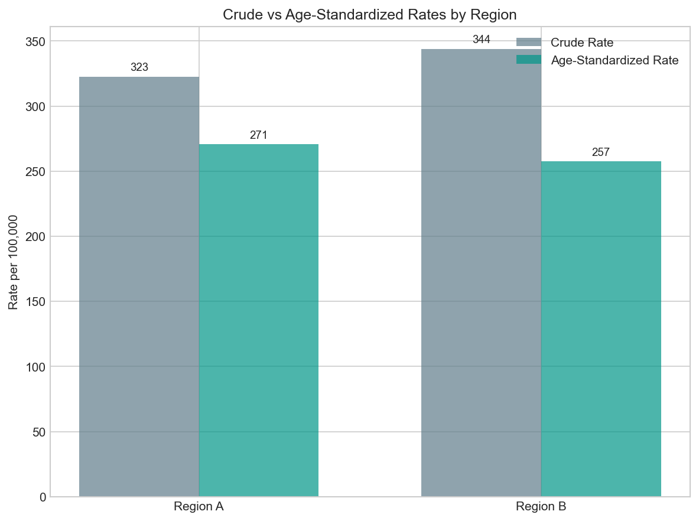

# Direct Age-Standardized Rate

## 1. What it's for

A **directly age-standardized rate** (ASR) is a weighted average of age-specific rates, where weights come from a "standard" population. It removes the confounding effect of age structure when comparing populations.

!!! warning "Critical: This is a comparative index, not an actual rate"
    The ASR does NOT represent the rate that would actually be observed in any real population. It's a hypothetical rate answering: *"What would the rate be if this population had the age structure of the standard population?"*

    Use ASRs for **ranking and comparison only**. For actual burden estimates, use crude rates or age-specific rates.

## 2. When appropriate

✅ **Use when:**

- Comparing disease burden across populations with different age structures
- Tracking trends over time when age structure is changing
- Creating rankings or league tables
- You need a single summary number for comparison (not absolute meaning)

❌ **Don't use when:**

- You need to estimate actual disease burden (use crude rates)
- Age-specific rates vary dramatically in direction across groups
- Populations have very different age ranges
- Communicating to audiences who may misinterpret as actual rates

## 3. Data needed

| Field | Type | Units | Notes |
|-------|------|-------|-------|
| `counts_by_age` | Array | Counts | Cases in each age group |
| `pop_by_age` | Array | Counts | Population in each age group |
| `std_weights` | Array | Proportions | Standard population weights (must sum to 1) |

All arrays must have the **same length** with **consistent age group definitions**.

## 4. Definition / Formula

**Plain language:** Calculate the rate in each age group, then take a weighted average where the weights represent how common each age group is in a chosen "standard" population.

**Formula:**

$$
\text{ASR} = \sum_{i=1}^{k} \left( \frac{c_i}{n_i} \times w_i \right) \times \text{Scale}
$$

Where:

- $c_i$ = cases in age group $i$
- $n_i$ = population in age group $i$
- $w_i$ = proportion of standard population in age group $i$
- $k$ = number of age groups
- Weights must satisfy: $\sum_{i=1}^{k} w_i = 1$

**Why it works:** By applying the same weights to both populations, differences in age structure are "removed" from the comparison.

## 5. Implementation notes

!!! warning "Choice of standard population"
    The ASR value depends entirely on which standard population you choose. Common choices:

    - **Canadian Standard Population** (2011)
    - **US Standard Population** (2000)
    - **WHO World Standard Population**
    - **European Standard Population**

    Always document which standard you used. ASRs calculated with different standards are NOT comparable.

!!! warning "Edge cases"
    - **Zero population in an age group:** That group is excluded (with warning if cases > 0)
    - **Weights don't sum to 1:** Automatically normalized
    - **Mismatched array lengths:** Error
    - **Negative values:** Error

!!! tip "Age group consistency"
    The same age groups must be used for:

    1. Your case counts
    2. Your population data
    3. Your standard population weights

    If your data uses 5-year age groups but the standard uses 10-year groups, you must aggregate first.

## 6. Worked example

Using data from `docs/assets/data/age_stratified_example.csv` and `docs/assets/data/standard_population.csv`:

**Region A:**

| Age Group | Cases | Population | Age-Specific Rate | Std Weight |
|-----------|-------|------------|-------------------|------------|
| 0-14 | 12 | 15,000 | 80.0 | 0.18 |
| 15-44 | 35 | 22,000 | 159.1 | 0.40 |
| 45-64 | 48 | 18,000 | 266.7 | 0.25 |
| 65-74 | 62 | 12,000 | 516.7 | 0.10 |
| 75+ | 85 | 8,000 | 1062.5 | 0.07 |

Crude Rate: **322.7 per 100,000**
Age-Standardized Rate: **246.6 per 100,000**

**Region B:**

| Age Group | Cases | Population | Age-Specific Rate | Std Weight |
|-----------|-------|------------|-------------------|------------|
| 0-14 | 8 | 12,000 | 66.7 | 0.18 |
| 15-44 | 28 | 18,000 | 155.6 | 0.40 |
| 45-64 | 55 | 20,000 | 275.0 | 0.25 |
| 65-74 | 72 | 15,000 | 480.0 | 0.10 |
| 75+ | 95 | 10,000 | 950.0 | 0.07 |

Crude Rate: **344.0 per 100,000**
Age-Standardized Rate: **247.9 per 100,000**



**Interpretation:**

- Crude rates suggest Region B has higher burden (344 vs 323 per 100k)
- Age-standardized rates are nearly identical (248 vs 247 per 100k)
- The difference in crude rates is almost entirely due to Region B having an older population
- **For fair comparison**, the ASRs show these regions have similar underlying risk

## 7. Common mistakes

!!! danger "Mistake: Presenting ASR as actual disease burden"
    NEVER say "322 people per 100,000 will get this disease" based on an ASR. The ASR is a mathematical construct for comparison only. For actual burden, report crude rates or absolute numbers.

!!! danger "Mistake: Comparing ASRs with different standard populations"
    An ASR using the WHO standard is NOT comparable to one using the US standard. Always use the same standard when comparing, and clearly document which standard was used.

!!! danger "Mistake: Using ASR when age-specific patterns differ"
    If disease X has higher rates in young people in Region A but higher rates in old people in Region B, the ASR can be misleading. In such cases, present age-specific rates instead.

!!! danger "Mistake: Over-interpreting small differences"
    ASRs don't come with easy confidence intervals. Small differences (e.g., 245 vs 248) may not be meaningful. Consider the underlying case counts and use caution.

## 8. Copy-paste Python snippet

```python
import pandas as pd
from indicator_recipes import rate_per, direct_age_standardized_rate

# Load data
df = pd.read_csv("docs/assets/data/age_stratified_example.csv")
std_pop = pd.read_csv("docs/assets/data/standard_population.csv")

# Calculate for each region
for region in df["region"].unique():
    region_data = df[df["region"] == region]

    # Crude rate
    total_cases = region_data["cases"].sum()
    total_pop = region_data["population"].sum()
    crude = rate_per(total_cases, total_pop)

    # Age-standardized rate
    asr = direct_age_standardized_rate(
        counts_by_age=region_data["cases"].values,
        pop_by_age=region_data["population"].values,
        std_weights=std_pop["weight"].values,
    )

    print(f"{region}:")
    print(f"  Crude rate:           {crude:.1f} per 100,000")
    print(f"  Age-standardized rate: {asr:.1f} per 100,000")
    print()
```

**Output:**
```
Region A:
  Crude rate:           322.7 per 100,000
  Age-standardized rate: 246.6 per 100,000

Region B:
  Crude rate:           344.0 per 100,000
  Age-standardized rate: 247.9 per 100,000
```

## 9. References

1. **Bhopal RS.** *Concepts of Epidemiology.* 3rd ed. Oxford University Press; 2016. Chapter 5: Comparing disease rates.

2. **Statistics Canada.** Age-standardization and the calculation of standardized mortality ratios (SMRs). Methods document.

3. **Naing NN.** Easy way to learn standardization: direct and indirect methods. *Malays J Med Sci.* 2000;7(1):10-15.

4. **Ahmad OB, et al.** Age Standardization of Rates: A New WHO Standard. GPE Discussion Paper Series No. 31. WHO; 2001.
