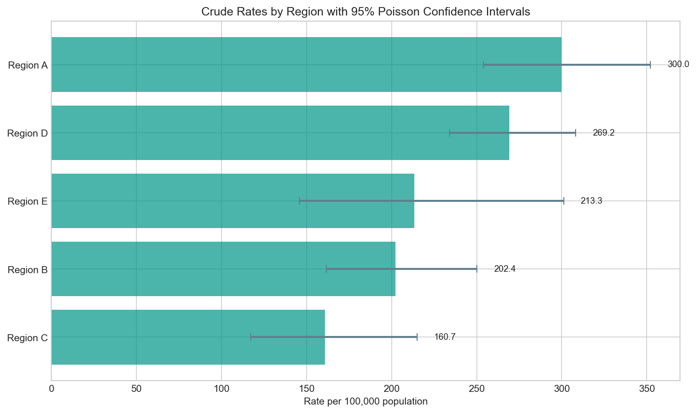

# Crude Rate per 100,000 + Poisson CI

## 1. What it's for

A **crude rate** expresses the frequency of events (cases, deaths, hospitalizations) relative to the population at risk. It answers: *"How common is this outcome in this population?"*

The **Poisson confidence interval** quantifies uncertainty due to random variation in case counts.

## 2. When appropriate

✅ **Use when:**

- Reporting disease incidence or prevalence in a single population
- Comparing the same population over time (if age structure is stable)
- Events are relatively rare and independent
- You need to communicate actual burden to decision-makers

❌ **Don't use when:**

- Comparing populations with different age structures (use age-standardized rates)
- Events are very common (rate approaches 100%)
- Events are clustered/correlated (violates Poisson assumption)

## 3. Data needed

| Field | Type | Units | Notes |
|-------|------|-------|-------|
| `cases` | Integer | Count | Number of events in numerator |
| `population` | Integer | Count | Population at risk (denominator) |
| `scale` | Integer | - | Usually 100,000 or 1,000 |

## 4. Definition / Formula

**Plain language:** Divide the number of cases by the population, then multiply by a convenient number (usually 100,000) so you're not dealing with tiny decimals.

**Formula:**

$$
\text{Rate} = \frac{\text{Cases}}{\text{Population}} \times \text{Scale}
$$

**Poisson Confidence Interval:**

For case count $n$, the exact confidence interval uses the chi-square distribution:

$$
\text{Lower} = \frac{\chi^2_{\alpha/2, 2n}}{2 \times \text{Population}} \times \text{Scale}
$$

$$
\text{Upper} = \frac{\chi^2_{1-\alpha/2, 2(n+1)}}{2 \times \text{Population}} \times \text{Scale}
$$

This is exact and works well even for small counts (unlike normal approximation methods).

## 5. Implementation notes

!!! warning "Edge cases"
    - **Zero cases:** Rate = 0, lower CI = 0, upper CI > 0
    - **Zero population:** Error - cannot divide by zero
    - **Negative values:** Error - counts and population must be non-negative
    - **Non-integer cases:** Rounded to nearest integer for CI calculation

!!! tip "Scale choice"
    Use the smallest scale that gives readable numbers:

    - Rare diseases: per 100,000 or 1,000,000
    - Common conditions: per 1,000 or 100
    - Annual rates: consider person-years as denominator

## 6. Worked example

Using data from `docs/assets/data/crude_rate_example.csv`:

| Region | Cases | Population | Rate per 100k | 95% CI |
|--------|-------|------------|---------------|--------|
| Region A | 150 | 50,000 | 300.0 | (253.4 - 352.0) |
| Region B | 85 | 42,000 | 202.4 | (161.6 - 250.0) |
| Region C | 45 | 28,000 | 160.7 | (117.2 - 215.2) |
| Region D | 210 | 78,000 | 269.2 | (233.8 - 308.4) |
| Region E | 32 | 15,000 | 213.3 | (145.9 - 301.2) |



**Interpretation:**

- Region A has the highest rate at 300 per 100,000
- Region E has a wide confidence interval (fewer cases = more uncertainty)
- Overlapping CIs suggest differences may not be statistically significant

## 7. Common mistakes

!!! danger "Mistake: Comparing crude rates across populations with different age structures"
    Older populations have higher death rates. A region with an older population will have a higher crude mortality rate even if age-specific rates are identical. Use age-standardized rates for fair comparisons.

!!! danger "Mistake: Using normal approximation CI for small counts"
    The normal approximation (rate ± 1.96 × SE) can produce negative lower bounds and is inaccurate for n < 30. Always use the exact Poisson method for small counts.

!!! danger "Mistake: Mixing time periods"
    A rate of "150 cases per 100,000" is meaningless without specifying the time period (per year? per month?). Always state the time period.

## 8. Copy-paste Python snippet

```python
import pandas as pd
from indicator_recipes import rate_per, poisson_rate_ci

# Load data
df = pd.read_csv("docs/assets/data/crude_rate_example.csv")

# Calculate rates and CIs
results = []
for _, row in df.iterrows():
    rate = rate_per(row["cases"], row["population"])
    lower, upper = poisson_rate_ci(row["cases"], row["population"])
    results.append({
        "region": row["region"],
        "cases": row["cases"],
        "population": row["population"],
        "rate_per_100k": round(rate, 1),
        "ci_lower": round(lower, 1),
        "ci_upper": round(upper, 1),
    })

results_df = pd.DataFrame(results)
print(results_df.to_string(index=False))
```

**Output:**
```
   region  cases  population  rate_per_100k  ci_lower  ci_upper
 Region A    150       50000          300.0     253.4     352.0
 Region B     85       42000          202.4     161.6     250.0
 Region C     45       28000          160.7     117.2     215.2
 Region D    210       78000          269.2     233.8     308.4
 Region E     32       15000          213.3     145.9     301.2
```

## 9. References

1. **Ulm K.** A simple method to calculate the confidence interval of a standardized mortality ratio. *Am J Epidemiol.* 1990;131(2):373-375.

2. **Rothman KJ, Greenland S, Lash TL.** *Modern Epidemiology.* 3rd ed. Philadelphia: Lippincott Williams & Wilkins; 2008. Chapter 10: Precision and Validity.

3. **Kirkwood BR, Sterne JAC.** *Essential Medical Statistics.* 2nd ed. Blackwell Science; 2003. Chapter 24: Rates.
