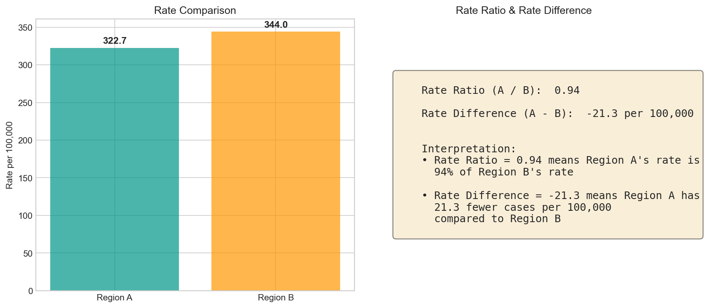

# Rate Ratio & Rate Difference

## 1. What it's for

**Rate ratio** (RR) and **rate difference** (RD) compare rates between two groups:

- **Rate Ratio** = Rate in Group A ÷ Rate in Group B (relative comparison)
- **Rate Difference** = Rate in Group A − Rate in Group B (absolute comparison)

Together, they answer: *"How much higher (or lower) is the rate in one group compared to another?"*

## 2. When appropriate

✅ **Use when:**

- Comparing exposed vs unexposed groups
- Evaluating health disparities between populations
- Assessing intervention effectiveness (treatment vs control)
- You have a clear reference group

❌ **Don't use when:**

- No meaningful reference group exists
- Groups aren't comparable (different age structures without adjustment)
- Comparing more than 2 groups (need different methods)

**Rate Ratio vs Rate Difference:**

| Measure | Best for | Interpretation |
|---------|----------|----------------|
| Rate Ratio | Etiologic research, relative risk | "2x higher risk" |
| Rate Difference | Public health impact, absolute burden | "100 excess cases per 100k" |

## 3. Data needed

| Field | Type | Units | Notes |
|-------|------|-------|-------|
| `cases_a` | Integer | Count | Cases in group A |
| `pop_a` | Integer | Count | Population of group A |
| `cases_b` | Integer | Count | Cases in reference group B |
| `pop_b` | Integer | Count | Population of reference group B |

## 4. Definition / Formula

**Rate Ratio:**

$$
\text{RR} = \frac{\text{Rate}_A}{\text{Rate}_B} = \frac{c_A / n_A}{c_B / n_B}
$$

- RR = 1.0: No difference
- RR > 1.0: Higher rate in group A
- RR < 1.0: Lower rate in group A

**Rate Difference:**

$$
\text{RD} = \text{Rate}_A - \text{Rate}_B = \left(\frac{c_A}{n_A} - \frac{c_B}{n_B}\right) \times \text{Scale}
$$

- RD = 0: No difference
- RD > 0: Excess cases in group A
- RD < 0: Fewer cases in group A

## 5. Implementation notes

!!! warning "Edge cases"
    - **Zero cases in reference group:** RR undefined (division by zero); RD still valid
    - **Zero cases in both groups:** RR = 1.0 (no difference); RD = 0
    - **Very small denominators:** Both measures become unstable

!!! tip "Choosing the reference group"
    The reference group (group B, denominator) should be:

    - The unexposed/control group in cohort studies
    - The larger or more stable population for descriptive comparisons
    - Clearly labeled in all outputs

    Swapping reference groups inverts the RR (2.0 becomes 0.5) and negates the RD (+100 becomes -100).

!!! info "Confidence intervals"
    This MVP provides point estimates only. For CIs:

    - **RR:** Log-transform, calculate SE, then back-transform
    - **RD:** Use variance formula for difference of proportions

    These can be added in future versions.

## 6. Worked example

Comparing Region A and Region B from our age-stratified data:

| Metric | Region A | Region B |
|--------|----------|----------|
| Total Cases | 242 | 258 |
| Total Population | 75,000 | 75,000 |
| Crude Rate (per 100k) | 322.7 | 344.0 |

**Calculations:**

- **Rate Ratio** (A vs B): 322.7 / 344.0 = **0.94**
- **Rate Difference** (A − B): 322.7 − 344.0 = **-21.3 per 100,000**



**Interpretation template:**

> Region A has a rate ratio of **0.94** compared to Region B, meaning Region A's rate is 94% of Region B's rate (or 6% lower).
>
> The rate difference is **-21.3 per 100,000**, meaning Region A has approximately 21 fewer cases per 100,000 population compared to Region B.

## 7. Common mistakes

!!! danger "Mistake: Confusing rate ratio with odds ratio"
    Rate ratio compares incidence rates (events / person-time or events / population). Odds ratio compares odds (events / non-events). They are similar only when events are rare (<10%). Don't interchange them.

!!! danger "Mistake: Interpreting RR without context of baseline risk"
    An RR of 2.0 sounds alarming, but:

    - If baseline risk is 1 per million → exposed risk is 2 per million (trivial)
    - If baseline risk is 10% → exposed risk is 20% (substantial)

    Always report both RR and absolute rates or RD.

!!! danger "Mistake: Comparing rates without adjusting for confounders"
    If Region A is younger than Region B, the crude rate comparison is confounded by age. Either:

    - Compare age-standardized rates, or
    - Use age-adjusted RR/RD methods (stratified analysis, regression)

!!! danger "Mistake: Forgetting to specify reference group"
    "The rate ratio was 2.0" is incomplete. Always specify: "The rate ratio comparing Group A to Group B (reference) was 2.0."

## 8. Copy-paste Python snippet

```python
import pandas as pd
from indicator_recipes import rate_per, rate_ratio, rate_difference

# Load data
df = pd.read_csv("docs/assets/data/age_stratified_example.csv")

# Aggregate to get totals by region
region_totals = df.groupby("region").agg({
    "cases": "sum",
    "population": "sum"
}).reset_index()

# Extract group data
region_a = region_totals[region_totals["region"] == "Region A"].iloc[0]
region_b = region_totals[region_totals["region"] == "Region B"].iloc[0]

# Calculate rates
rate_a = rate_per(region_a["cases"], region_a["population"])
rate_b = rate_per(region_b["cases"], region_b["population"])

# Calculate ratio and difference
rr = rate_ratio(
    region_a["cases"], region_a["population"],
    region_b["cases"], region_b["population"]
)
rd = rate_difference(
    region_a["cases"], region_a["population"],
    region_b["cases"], region_b["population"]
)

print("Rate Comparison: Region A vs Region B (reference)")
print(f"  Region A rate: {rate_a:.1f} per 100,000")
print(f"  Region B rate: {rate_b:.1f} per 100,000")
print(f"  Rate Ratio:    {rr:.2f}")
print(f"  Rate Difference: {rd:.1f} per 100,000")
```

**Output:**
```
Rate Comparison: Region A vs Region B (reference)
  Region A rate: 322.7 per 100,000
  Region B rate: 344.0 per 100,000
  Rate Ratio:    0.94
  Rate Difference: -21.3 per 100,000
```

### Interpretation helper

```python
def interpret_comparison(rr, rd, group_a_name, group_b_name):
    """Generate plain-language interpretation."""
    if rr > 1:
        rr_text = f"{group_a_name} has {rr:.1%} the rate of {group_b_name} ({(rr-1)*100:.0f}% higher)"
    elif rr < 1:
        rr_text = f"{group_a_name} has {rr:.1%} the rate of {group_b_name} ({(1-rr)*100:.0f}% lower)"
    else:
        rr_text = f"{group_a_name} and {group_b_name} have equal rates"

    if rd > 0:
        rd_text = f"{abs(rd):.1f} excess cases per 100,000 in {group_a_name}"
    elif rd < 0:
        rd_text = f"{abs(rd):.1f} fewer cases per 100,000 in {group_a_name}"
    else:
        rd_text = "No difference in absolute rates"

    return rr_text, rd_text

rr_interp, rd_interp = interpret_comparison(rr, rd, "Region A", "Region B")
print(f"\nInterpretation:")
print(f"  {rr_interp}")
print(f"  {rd_interp}")
```

## 9. References

1. **Rothman KJ.** *Epidemiology: An Introduction.* 2nd ed. Oxford University Press; 2012. Chapter 4: Measures of Effect.

2. **Szklo M, Nieto FJ.** *Epidemiology: Beyond the Basics.* 4th ed. Jones & Bartlett; 2019. Chapter 3: Measuring Associations.

3. **Greenland S.** Interpretation and choice of effect measures in epidemiologic analyses. *Am J Epidemiol.* 1987;125(5):761-768.
