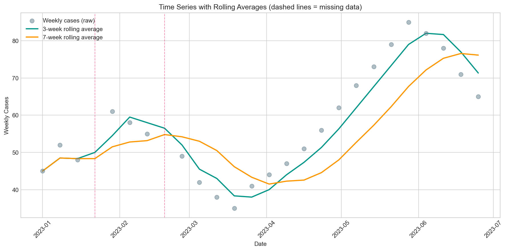

# Rolling Average

## 1. What it's for

A **rolling average** (moving average) smooths time series data by averaging values within a sliding window. It reveals underlying trends by reducing noise from random day-to-day or week-to-week variation.

## 2. When appropriate

✅ **Use when:**

- Visualizing trends in noisy time series data
- Detecting outbreaks or seasonal patterns
- Communicating trends to non-technical audiences
- Data has random variation that obscures the signal

❌ **Don't use when:**

- You need to detect rapid changes (rolling averages lag)
- Data points are not evenly spaced in time
- You need point estimates for statistical testing
- Real-time decision-making requires the most recent unsmoothed data

## 3. Data needed

| Field | Type | Units | Notes |
|-------|------|-------|-------|
| `date` | Date | - | Evenly spaced time points |
| `value` | Numeric | Any | The measure to smooth (cases, rates, etc.) |
| `window` | Integer | Time units | Number of periods to average |

## 4. Definition / Formula

**Plain language:** For each point, calculate the average of that point and its neighbors within the window.

**Trailing average** (default): Average of current and previous `window-1` observations:

$$
\bar{x}_t = \frac{1}{w} \sum_{i=0}^{w-1} x_{t-i}
$$

**Centered average**: Average of observations centered around current point (requires future data):

$$
\bar{x}_t = \frac{1}{w} \sum_{i=-\lfloor w/2 \rfloor}^{\lfloor w/2 \rfloor} x_{t+i}
$$

**Handling missing data:**

- `min_periods`: Minimum non-missing values required to compute average
- If `min_periods=1`, partial windows produce values
- If `min_periods=window` (default), full window required

## 5. Implementation notes

!!! warning "Edge cases"
    - **Missing values (NaN):** Excluded from calculations; window shrinks but still applies
    - **Start of series:** With default `min_periods`, first `window-1` values are NaN
    - **Centered windows:** Require "future" data; inappropriate for real-time analysis
    - **Uneven spacing:** Results are misleading if time intervals vary

!!! tip "Choosing window size"

    | Context | Suggested window |
    |---------|------------------|
    | Weekly data, reduce noise | 3-4 weeks |
    | Daily data, see weekly pattern | 7 days |
    | Outbreak detection | 5-7 days |
    | Seasonal patterns | 12 months (monthly data) |

    Larger windows = smoother but more lag; smaller windows = less lag but noisier.

## 6. Worked example

Using data from `docs/assets/data/time_series_example.csv`:

This dataset has 26 weeks of case counts with **2 missing values** (weeks 4 and 8).

| Week | Raw Cases | 3-Week Avg | 7-Week Avg | Notes |
|------|-----------|------------|------------|-------|
| 1 | 45 | 45.0 | 45.0 | Partial window |
| 2 | 52 | 48.5 | 48.5 | Partial window |
| 3 | 48 | 48.3 | 48.3 | Full window |
| 4 | - | 50.0 | 48.3 | Missing data |
| 5 | 61 | 54.5 | 51.5 | - |
| ... | ... | ... | ... | - |



**Interpretation:**

- Raw data (dots) shows weekly variation
- 3-week average (teal) follows trends with minimal lag
- 7-week average (orange) is smoother but lags more during the spring increase
- Dashed vertical lines mark missing data points - the rolling average handles these gracefully

## 7. Common mistakes

!!! danger "Mistake: Using centered averages for real-time reporting"
    Centered averages look great but require future data. In real-time surveillance, use trailing averages only. Never fill in centered averages with projected values.

!!! danger "Mistake: Ignoring the interpretation of missing data"
    When data is missing, the rolling average uses available values. If missingness is systematic (e.g., weekends), this biases results. Consider filling known gaps before averaging.

!!! danger "Mistake: Choosing window size after seeing results"
    Select your window size based on subject matter (e.g., "weekly reporting cycle" = 7-day window) BEFORE looking at results. Post-hoc window selection is a form of p-hacking.

!!! danger "Mistake: Comparing rolling averages with different windows"
    A 7-day average will always look smoother than a 3-day average. When comparing regions or time periods, use the same window size.

## 8. Copy-paste Python snippet

```python
import pandas as pd
from indicator_recipes import rolling_mean

# Load data
df = pd.read_csv("docs/assets/data/time_series_example.csv")
df["date"] = pd.to_datetime(df["date"])

# Calculate rolling averages
# min_periods=1 allows partial windows at the start
df["rolling_3wk"] = rolling_mean(df["cases"], window=3, min_periods=1)
df["rolling_7wk"] = rolling_mean(df["cases"], window=7, min_periods=1)

# Display results
print(df[["date", "cases", "rolling_3wk", "rolling_7wk"]].head(10).to_string(index=False))
```

**Output:**
```
       date  cases  rolling_3wk  rolling_7wk
 2023-01-01   45.0         45.0         45.0
 2023-01-08   52.0         48.5         48.5
 2023-01-15   48.0         48.3         48.3
 2023-01-22    NaN         50.0         48.3
 2023-01-29   61.0         54.5         51.5
 2023-02-05   58.0         59.5         52.8
 2023-02-12   55.0         58.0         53.0
 2023-02-19    NaN         56.5         54.8
 2023-02-26   49.0         52.0         54.2
 2023-03-05   42.0         45.5         53.0
```

### Visualization code

```python
import matplotlib.pyplot as plt

fig, ax = plt.subplots(figsize=(12, 6))

ax.scatter(df["date"], df["cases"], alpha=0.5, label="Raw weekly cases")
ax.plot(df["date"], df["rolling_3wk"], label="3-week rolling average")
ax.plot(df["date"], df["rolling_7wk"], label="7-week rolling average")

ax.set_xlabel("Date")
ax.set_ylabel("Weekly Cases")
ax.legend()
plt.show()
```

## 9. References

1. **CDC.** COVID-19 Data Tracker Technical Notes: 7-Day Moving Averages. Available at: https://covid.cdc.gov/covid-data-tracker

2. **Hyndman RJ, Athanasopoulos G.** *Forecasting: Principles and Practice.* 3rd ed. OTexts; 2021. Chapter 3: Time series decomposition.

3. **Shumway RH, Stoffer DS.** *Time Series Analysis and Its Applications.* 4th ed. Springer; 2017. Chapter 1: Characteristics of Time Series.
